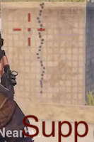
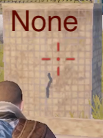

# Pubg Mobile attachments info

---

All pages : [Main page](/index.md) \ [Play Style](/play_style.md) \ [Weapons](/weapons.md) \ [Recoil patterns](/recoil.md) \ [Attachments](/attachments.md) \ [Settings](/settings) \ [Controls](/controls.md) \ [Tips](/tips.md)

---

Tested with the same methodology as [recoil](/recoil.md)

## Muzzles, Stocks, etc ...

A few commonly used weapons, all tested without grips.

Findings:

- For any high recoil weapons, use the compensator
- For low recoil weapons, you should use suppressor (less noise), or the flash hider if you like to snake
- Stocks and cheek pads are good to use if available
- On shotguns, both duck bill and choke make a huge difference, use them !

### AKM

   

### Kar98

    

### M416

    

### M762

   

### S1897

  

### SKS

   

### Uzi

   

## Grips

### M416

Tested on M416 without any other attachments, 3 times per grip.

Seems to me on an AR the vertical grip or the half grip are good options

#### No Grip:

  

#### Thumb grip:

Does not seem to do much recoil wise, but it provides faster ADS.

  

#### Half grip:

Seems to help **slightly** with both horizontal and vertical recoil, also gives faster recoil recovery, not a bad choice.

  

#### Light grip:

Seems to **maybe** help a bit on horizontal recoil, but supposed to be good on snipers

  

#### Vertical grip:

Does what you would expect, reduces the vertical (only) recoil a bit

  

#### Angled grip:

This is supposed to reduce recoil, but I'm not really seeing it

  

### SKS

todo
