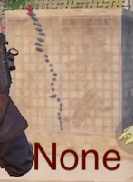
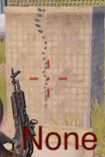
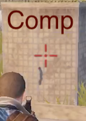
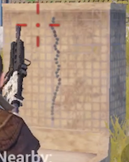

# Pubg Mobile attachments info

---

All pages : [Main page](/index.md) \ [Play Style](/play_style.md) \ [Weapons](/weapons.md) \ [Recoil patterns](/recoil.md) \ [Attachments](/attachments.md) \ [Settings](/settings) \ [Controls](/controls.md) \ [Tips](/tips.md)

---

Tested with the same methodology as [recoil](/recoil.md)

Note that Bushka thinks that this methodology is dumb, because you
don't need to unload a whole mag into an opponent, so only the first few bullets matter, I partly agree, a few observations though :

- It's true for AR's but not SMG's, where you DO need to unload most of the clip
- For AR's, it's true that you should only 4 bullets if the target is stationary, if they are running, you may need to unload half the clip to land the 4 shots to get the kill, hence I think checking the recoil over the full mag is not completely meaningless.

So wth that said you can decide if you want to observe only the first few bullet holes or more.

## Muzzles, Stocks, etc ...

A few commonly used weapons, all tested without grips.

Findings:

- For any high recoil weapons, use the compensator
- For low recoil weapons, you should use suppressor (less noise), or the flash hider if you really like to snake
- Stocks and cheek pads are good to use when available
- On shotguns, both duck bill and choke make a huge difference, use them !

### AKM

   

### Kar98

    

### M416

    

### M762

   

### S1897

  

### SKS

   

### Uzi

   

---

## Grips

Bushka grip video : https://www.youtube.com/watch?v=8ccHjK3eWGE

### M416

Tested on the M416 without any other attachments, 3 tries per grip.

Seems to me that on an AR the vertical grip or the half grip are good options

#### No Grip:

  

#### Thumb grip:

Does not seem to do much recoil wise, but it provides faster ADS.

  

#### Half grip:

Seems to help **a bit** with both horizontal and vertical recoil, also gives faster recoil recovery, not a bad choice.

  

#### Light grip:

Seems to **maybe** help a bit on horizontal recoil, but at least on the m416 that seems pretty negligible, supposed to be good on snipers and dmrs though.

  

#### Vertical grip:

Does what you would expect, reduces the vertical (only) recoil

  

#### Angled grip:

This is supposed to reduce recoil, but I'm not really seeing any benefit.

  

### MP5K

todo
