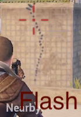
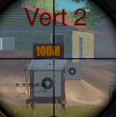

# Pubg Mobile attachments info

---

All pages : [Main page](/index.md) \ [Play Style](/play_style.md) \ [Weapons](/weapons.md) \ [Recoil patterns](/recoil.md) \ [Attachments](/attachments.md) \ [Settings](/settings) \ [Controls](/controls.md) \ [Tips](/tips.md)

---

Tested with the same methodology as [recoil](/recoil.md)

Note that Bushka thinks that this methodology is dumb, because you
don't need to unload a whole mag into an opponent, so only the first few bullets matter, I partly agree, a few observations though :

- It's true for AR's but not SMG's, where you DO need to unload most of the clip
- For AR's, it's true that you should only 4 bullets if the target is stationary, if they are running, you may need to unload half the clip to land the 4 shots to get the kill, hence I think checking the recoil over the full mag is not completely meaningless.

So with that said you can decide if you want to observe only the first few bullet holes or more.

## Muzzles, Stocks, etc ...

A few commonly used weapons, all tested without grips.

Findings:

- For any high recoil weapons, use the compensator
- For low recoil weapons, you should use suppressor (less noise), or the flash hider if you really like to snake
- Stocks and cheek pads are awesome to use when available.
- On shotguns, both duck bill and choke make a huge difference, use them !

### AKM

   

### Kar98

    

### M416

    

### M762

   

### S1897

  

### SKS

   

### Uzi

   

---

## Grips

Bushka grip video : https://www.youtube.com/watch?v=8ccHjK3eWGE

First, I want to say a compensator(SMG, AR) or cheek pad(DMR, Snipers) seems to have way more effect on recoil than any grip, so keep that in mind.

My recommendations:

- Low recoil weapons(ie: SMG): Use the thumb grip, for faster ADS
- High recoil weapons: If you know how to manage the vertical recoil, try the half grip, it will help with horizontal recoil, which you can not really manage yourself.
- If you can not manage vertical recoil, try fixing your sensitivity, but if it's still a problem then use the vertical grip
- When using "single fire" (tapping), the light grip is supposed to be good (first 2 shots) however I have found no evidence of this at all.
- The angle grip seems useless to me

--=

### M416

Tested on the M416 without any other attachments, 3 tries per grip.

#### No Grip:

  

#### Thumb grip:

Does not seem to do much recoil wise, but it provides faster ADS.

  

#### Half grip:

Seems to help **a bit** with both horizontal and vertical recoil, also gives faster recoil recovery, not a bad choice.

  

#### Light grip:

Seems to **maybe** help a bit on horizontal recoil, but at least on the m416 that seems pretty negligible, supposed to be good on snipers and dmrs though.

  

#### Vertical grip:

Does what you would expect, reduces the vertical (only) recoil

  

#### Angled grip:

This is supposed to reduce recoil, but I'm not really seeing any benefit.

  

---

### SKS

Tested with an SKS without other attachments, 4 single shots, without trying to controll recoil manually in between.

#### No Grip:

   

#### Thumb grip:

Slightly improved vertical and horizontal recoil

   

#### Half grip:

Does not seem all that useful with single fire

   

#### Light grip:

This is supposed to be good for single fire, however I see zero evidence that it helps at all with the amount of recoil (maybe it helps with recoil recovery speed between shots, I have not tested that yet)

   

#### Vertical grip:

Again, the vertical grip does it's job, this is the only one so far to keep all 4 shots bellow the house roof line.

   

#### Angled grip:

Similar to the thumb grip, helps a little bit, not much

   

#### Angled grip + Compensator + Cheek Pad

This is to highlight that the grips are not actually having much effect compared to what the compensator and cheek pad can do. The SKS fully kitted with these is **night and day** compared to the minimal effect of a specific grip, see how much better this looks !

   
