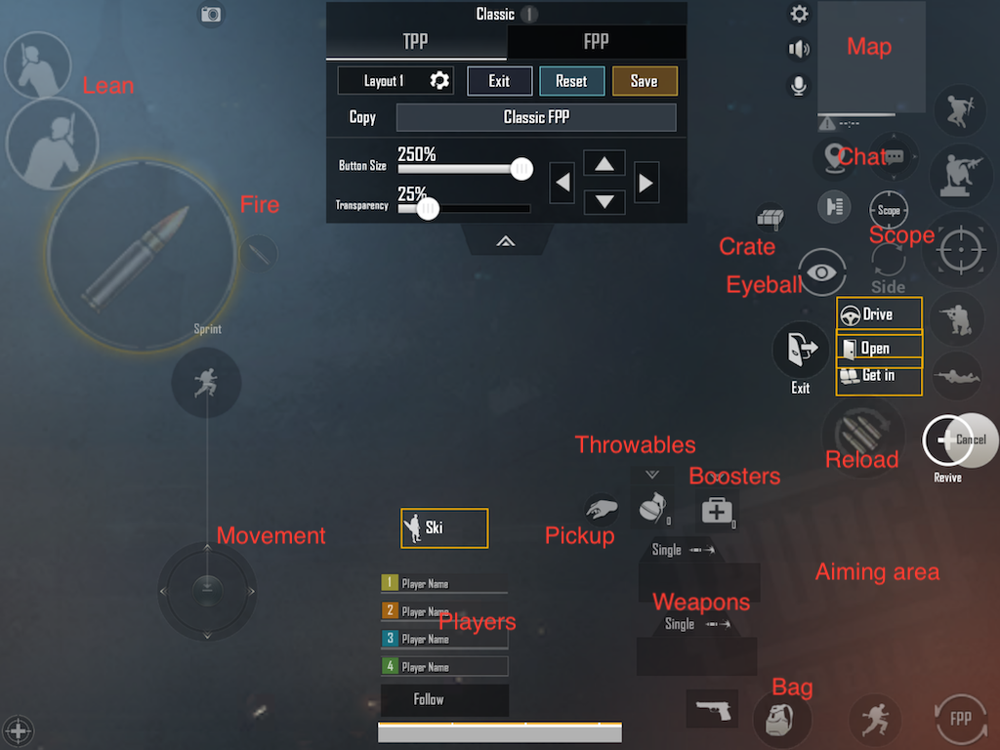
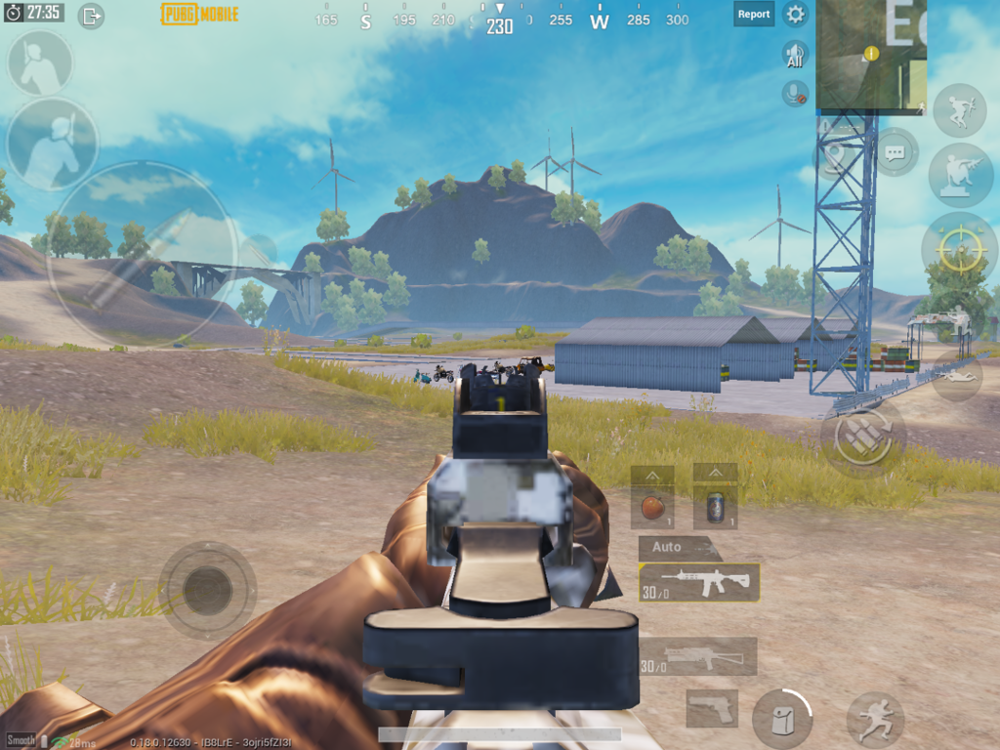
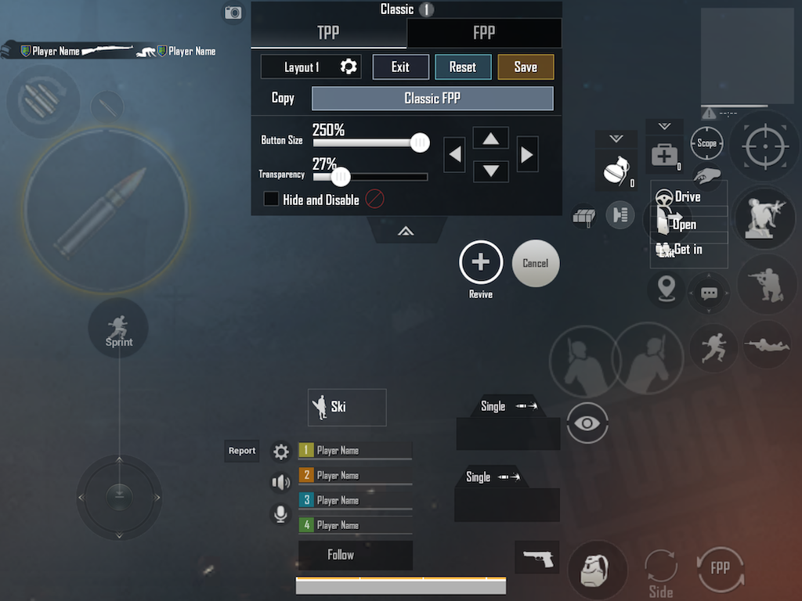

# Pub Mobile controls

---

All pages : [Main page](/index.md) \ [Play Style](/play_style.md) \ [Weapons](/weapons.md) \ [Recoil patterns](/recoil.md) \ [Attachments](/attachments.md) \ [Settings](/settings) \ [Controls](/controls.md) \ [Tips](/tips.md)

---

There is nothing I have messed with more than my controls layout, and this is probably how you can improve the most

## Table of contents

- [Thumbs](#thumbs)
- [3 Fingers Claw](#3-fingers-claw)
- [Gyro](Gyro)
- [4+ Fingers](#4-fingers)
- [June 2020 layout](#june-2020-layout)
- [July 2020 update](#july-2020-update)

### Thumb, 3, 4, x Fingers Claw

#### Thumbs

I first started playing (season 3) on a phone, with two thumbs, nothing wrong with that, and some players are awesome at it, however that limits your options, for example you can't jump and shoot at the same time, or lean, scope, and shoot, and so on.

### 3 fingers claw

Going from 2 fingers to 3 is the largest gain in my opinion.

If you shoot with your right (aiming finger), it means:

- You need to lift your finger and then drop it on the fire button to start firing , this is slow, and you can't aim while your finger is lifted, during which the opponent may still be moving.
- Can't tap and aim at the same time, so basically can't spam DMR's, every time you lift and drop your finger for a new shot, you lose your aiming.

So you should really try to add that third finger, have the shoot button (the one of the two that does not aim) on your index finger (top right or top left)

It might not be comfortable on a phone though, depends of your phone and hands size, I could not do it comfortably, so I'm using an Ipad now.

### Gyro

If you can't use the third finger, Gyro is a good alternative, because you can use it for aiming while you shoot. It can be a bit tricky though, and might not work well in CQC, you might end-up with your phone in a weird position, like between your knees and have to reset at times, still, it's better than using only 2 fingers.

### 4+ Fingers

If you can do 3 fingers, probably 4 is not much harder, in that case using that extra fingers for scoping or jumping/crouching makes sense, so you can move, shoot, aim, jump at all once for example.

After that you can try 5,6,8 fingers but you will need a large screen and a lot of dexterity, for me 4 or so is enough and 6+ is uncomfortable even on an iPad.

Bushka video on switching to 6 fingers: <https://www.youtube.com/watch?v=wA_2j3eA8KE>

### My current layout

I keep changing and tweaking it, but here is what I have now (June 20202), and I'll explain why, there are many many trials and errors and gotchas behind it.
wWhen using 3+ fingers by hand, it rotates my hands such as my thumb is on it's side rather than flat on the screen and I do not like it.

Note: I use an iPad (10.8") laying flat on a slanted stand, so I am not holding the device and not using gyro either.

This might appear very busy, but many of these buttons are contextual, here is what it looks like in-game, the middle of the screen is not busy.

In general I am trying to keep the center area de-cluttered, so I can see enemies easily.
There is a lot of thoughts behing every button placement, heres are explanations:

- Player movement:

  Left thumb controls the movement, nothing special here, but this finger is down almost all the time and can get sweaty, so I use a finger sleeve on that finger (only)

- Fire

  I use only the fire button that does not aim ("sniper fire"), since all my aiming is done with the right thumb. Why on the left ? If it was on the right it would make it a little harder to aim and shoot at the same time (same hand, limits individual finger motion a bit)

- Lean

  I'm still learning to use these more, but it's positioned so I can use my left middle finger on it while firing (5 finger claw), I focused on the right lean to be easier to use because it has advantages in game over the left one (less head showing, etc...)
  These buttons are on the left, because when on the right they tend to interfere with my aiming, the game gets confused because it's possible to aim with the lean button held down, wish that could be disabled as it's an annoyance when using claw.

- Player list

  That can go anywhere, but I like less stuff at the top of the screen so I can see the horizon, so I moved to be over my player's back, which is wasted space otherwise.

- Map

  Again, this could be anywhere, but I look at it a lot (sound markers etc...) and my eyes are usually looking toward the top of the screen

- Pickup (hand)

  I use auto pickup, so I don't need it too much, still I want to keep it close to my thumb. This expands in a larger window, so make sure nothing is under that space, otherwise you might be unable to pick something or say accidentally shoot instead :)
  Also, I don't want that to be in the middle of the screen as it pops up often and would block the view.

- Weapons

  The default location for these is bad, being able to quickly switch weapon, when one runs out of ammo, is a matter of life and death. I can quickly switch using my right thumb, as well as switch between single/burst/auto modes

- Throwables & Meds

  Also need these very easy to access, they expand up a lot, so need a lot of space above them. This is the best spot I found where they are easy to use without interfering with other buttons, but still out of the way (not hiding the playfield)

- Bag / autorun / FPP switch

  Just anywhere easy to access

- Aiming area

  A big empty space where I'm doing all my aiming (with or without gun), it needs to be wide enough that I don't accidentally press buttons while aiming, which means death.

- Reload

  This could be anywhere, as long as it's easy to access

- Revive / Cancel

  Again, want that fairly easy to access, so my teammate does not die while Iam looking for it

- Jump / crouch / prone

  I do all these wth my right index finger. All that finger does is "single tap" actions, This is because this reduces any chance of that finger being confused for the aiming one (thumb), I have had a lot of issues with that. If two fingers are on the right side of the screen, the game wil make the last one to land the one that aims, causing recoil control and aiming to appear "jammed" and likely death.

- Crate

  This expands into a huge area, I simply put it somewhere so that no other button would fall under that area and cause issues

- Chat / Markers

  If you play squads, you might want this very easy to access

- Scope

  I do that with my right index finger as well, a very common action

- Eyeball

  It's important to use this to look around while running, it has to be easy to access, but far away from any screen edge to allow to look in all directions.

- Car buttons (Get in, Drive, Exit)

  These need to be easy to access so you can easily jump in car without annoying the driver.
  The exit button need to be easy to access but also needs to be somewhere you wll not hit it by accident, you definitely don't want to press it by accident while trying to use meds or fire !

Go in the training mode and get in a car, make sure no buttons overlay the driving controls ! For example if your fire button is under the car turn left button, you won't have a good time.

Bushka, 6 fingers claw : <https://www.youtube.com/watch?v=HA191r_ISHE>

### July 2020 update

Like I said, I keep tweaking my layout, a couple new findings for me:

- Using more than 4 fingers is just uncomfortable for me, with 4 fingers it keeps my wrists vertical, but with more they turn horizontal and it becomes uncomfortable. I'm on a computer all day at work, I don't need more chances to get carpal tunnel from Pubg.

- The new version 0.19.0 of Pub mobile finally allows to turn on or off aiming with the peek & scope buttons, this use to cause all kind of issues with whichever of your aiming, fire, peek or scope button was last pressed becoming the aiming control. It's so much better now. So with this layout my peek buttons are set to aim, but the scope button is NOT.

