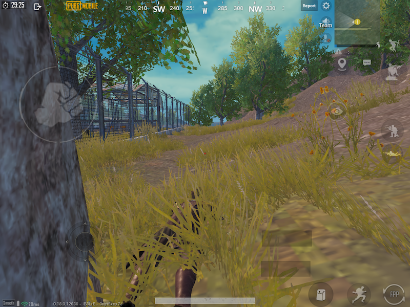
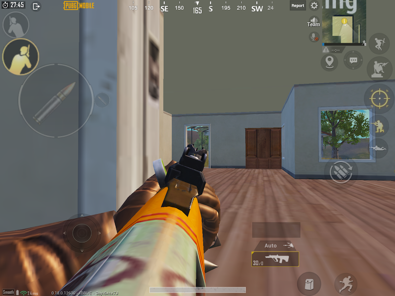

# Pubg Mobile - Play styles

---

All pages : [Main page](/index.md) \ [Play Style](/play_style.md) \ [Weapons](/weapons.md) \ [Recoil patterns](/recoil.md) \ [Attachments](/attachments.md) \ [Settings](/settings) \ [Controls](/controls.md) \ [Tips](/tips.md)

---

### FPP vs TPP

You can chose to play FPP (first person view) or TPP (third party camera)

Personally I much prefer FPP because:

- It does not encourage camping/hiding, if you can't see them, they can't see you
- It's more realistic, no hugging house corners to "look around"
- It feels faster

With that said, I actually only play TPP nowadays, because since the FPP option is not the default, much fewer people play it, so once you get to platinum level, it takes several minutes for a game to start, once in diamond or higher it's nearly impossible to get in a game :(

### Solo, Duo, Squads, solo-squads

#### Solos

Solos are fun because it's just you and you can do whatever you want, and you don't have to deal with other people, on the other hand that can be lonely I guess.

I like playing Solo a lot, however this Season (13), I have been running into cheaters almost every game. Either using cheats or forming teams (losers that must suck so bad that they need to squad up in solo mode to win), it's very frustrating, especially if you are trying to rank up.

It's hard to rank in solo, because in squad if any of your 3 teammate survives after you die, it will still help you to get some points

#### Duos

Duos are fun if you have a good friend to play with, there are a lot of good teams in duo because they are often players that pair together frequently and they play as a team.
On the other hand I think it's the least played mode overall.

#### Squads

Squads are the most fun, you have a whole team to hep you, and revive you,
that is if you have good teammates.

For the longest time I played only with random (players) squads and that was maddening, most of the time you will get one or several of these:

- disconnects before the game start
- decide to go to a hot drop by himself and cries for help 1 minute into the game
- keeps shooting at nothing or follow you with a car making a racquet, throws grenades at you
- Grabs all the loot
- Drives the car and crashes it in the middle of a squad
- the list goes on and on ...

If you don't have 4 good friends to play with **highly recommend joining a large active clan on discord**. The one I joined is casual but has a tryout out to make sure nobody toxic gets in, it's been a joy doing squads with these players.

#### Solo - squadding

If you are really really good and want a challenge, you can chose to play squads all by yourself (turn off auto player matching).

### Ranking

As you play more, you rank up (gold, platinum, ace etc...)
Just keep in mind that ranking up is an absolute grind and can be no fun.

The game very heavily favors survival time over anything else, so if you want to rank, the best plan is to hide and avoid conflict as long as you can, it works, but it's also very boring

Bushka, easiest way to rank : <https://www.youtube.com/watch?v=yTXB87oSZVE>
He is absolutely correct, but it's also not at all how he actually plays (aggressive)

### Snaking

Snaking is when you spend a good part of the game laying immobile in the grass waiting for an unsuspecting victim.

- Sometimes it's the right option at the very end of the game, if it's an open area
- The rest of the time, it's a super boring way to play
- Everyone hates snakes
- Sanhok is snake heaven ... and why I don't play it much anymore

Bushka, beating snakes: <https://www.youtube.com/watch?v=Yh7oXsPnS1k>

### Camping

Camping is similar to snaking, but in a building, you just stay there, motionless, waiting for someone to come through the door.

Same as snaking, it can be an effective tactic when you hear someone coming by a building you are in, but if you spend the whole game doing this, it's boring and everyone will hate you.

Bushka, house fighting : <https://www.youtube.com/watch?v=mR980hidSQw>

### Hot dropping / aggressive

Hot dropping, is when you land at very popular location such as Pochinki, Villa, Pecado or BootCamp. It's fun and makes you get improve, but it's aso very hard and unforgiving.

First, make sure you know how to parachute at full speed to even have a chance : <https://www.youtube.com/watch?v=Jkfdbqao9Uo>

Hot dropping is fun, but bad for ranking (unless you are crazy good), the reason being how Pubg points work, for example At Diamond level:

- Dying with only 5 people let and 3 kills : +15 points
- Dying early (90 people left) : -40 points

When hot dropping, dying early can mostly be a matter of luck, the guy next to you landed on a Uzi, not much you can do, but the ranking system beats you up for it.

Bushka, Hot dropping: <https://www.youtube.com/watch?v=fwQskziwp2c>

### Somewhere in between

So with that said, you can figure out if you want to rank and play super safe, or be a sweaty and do hot drops only, or do something in between.

### Jumping, Crouching, Going prone during a gunfight

A lot of people will jump around when you are shooting at them from a distance (Fortnite style), I don't think it's very useful, when someone jumps they can't turn while in the air, so you can time their landing to get a head shot.

Others will crouch while firing, this improves accuracy, but on the other hand it reduces mobility a lot. On top of that, if the opponent was aiming at body mass (belly), this might become a head shot. So all in all I don't think it's a good idea.

Yet another technique, is drop shooting, whereas you go prone in the middle of a gun fight, this can work as an element of surprise, but on the other hand you are a seating (laying?) duck. This is worth a shot in 1v1 CQC, but I would not do it in an open field.

In my opinion it's best is to keep standing and moving in semi random patterns.

Shooting at center mass : <https://www.youtube.com/watch?v=hh--SvIgxCk>

### Going for crates or not

It's in the same vein as playing safe for VS aggressive.

On the one hand getting an AWM or MK14 will be a massive advantage in the late game, but on the other hand you might die going to that crate.

### Getting better

The best way to get better is to play more, but there are some things you can not do in a classic game:

- Figure out your controls and sensitivity setting in training mode
- Play some acade games to practice 1v1 combat, you might only fight 3 enemies in a 20mn classic games, but have 50+ engagements in a 15mn Domination arcade game.

### Arcade games

Arcade games are a great way to practice.

- TDM / Domination / Ruins :

  A really good way to practice close quarter combat and random guns without caring about rank. I find Domination especially fun, less repetitive, a bit more strategy.

- War mode, sniper mode:

  Lets you practice specialty weapons in quick games.

- Quick game:

  Just like a normal game, but in a smaller zone with a higher people density, also a great way to practice while still in a more realistic classic game environment.

- Payload mode

  One of the few other game types I enjoy, the throwables are a ot of fun

- RageGear, a.k.a MadMax

  A decent way to practice shooting from moving vehicles

### Cheaters and hackers

Cheaters have been ridiculous lately.

- Use death replay, or watch & record your assassin after you die, try to record if they cheat
- Report them in game, even though it does not seem Tencent cares.

Common hacks:

- Pairing in solos, duos, squads: Several players, teams pairing up.
- Wall hacks : Go through or shoot through walls and mountains
- Scanners: They see you through walls and mountains
- Speed hack: Players running faster than a car
- Location hack: Players being all jittery or teleporting all over
- Aimbot: Player spraying a tommy gun in the air and landing all headshots
- Bullet damage hacks : a single bullet kills you or blows up a vehicle

Yeah, that's a lot of cheats, and that's not even a complete list, even all the streamers are complaining at this point:

- Bushka, Cheating epidemic : https://www.youtube.com/watch?v=pvem7M5qWhs
- Riggs : https://www.youtube.com/watch?v=sc7I8yGeEKY
