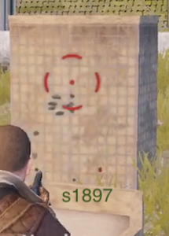
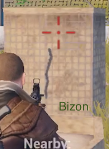
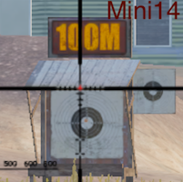
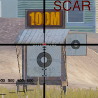

# Pubg Mobile recoil info

---

All pages : [Main page](/index.md) \ [Weapons](/weapons.md) \ [Recoil patterns](/recoil.md) \ [Controls](/controls.md) \ [Tips](/tips.md)

---

## Spray patterns

### Methodology

To get a good idea of the spray pattern, I'm shooting the guns at very short range (~6m ?) into a box hat has a grid pattern on it (training range)

A few notes:

- I picked this location because it's easy to square up against the two short boxes
- It's also close by all the weapons and attachments
- The tall box I fire into, has a grid pattern, and is roughly the size of a player, a bit taller and wider.
- I don't use any attachments of any kind (other than a red dot)
- This is just one sample, recoil is semi random, still it gives a good signal.
- For DMR's I spam them as fast as I can
- For auto weapons I unload a full mag (even though in real life you may not)

I start my spray at this point :

#### Pistols

- The skorpion does not do a lot of damage, but the spay pattern is a thing of beauty.
- The Deagle spray is terrible

     

#### Shotguns

- Not much of interest here, other than the s1897 seems to send a few pellets to random places

    

#### 5.56 ARs

- I knew something was off with the m16a4, ad this is "tapping", but boy, this shoots all over the place !
- I had noticed the QBZ felt a bit harder to handle, as you can see it has more horizontal recoil

    

#### 7.72 ARs

- As everone knows the AKM and berryl have very high vertical recoil, but as you can see the first 5 bullets are pretty god and that is enough to kill someone
- The Groza is any harder to handle than the 5.56 AR, yet does a lot more damage, use it !
- As far as burst weapons go, The mutant seems way more accurate than the M16A4

   

#### LMGs

- The DP28 is any harder to handle than the 5.56 AR, yet does a lot more damage, use it !
- The M249 as a crazy pattern, keep in minf it's 50 bullets and meant to spray but that left recoil is crazy

 

#### DMRs

- The Mini15 and QBU have very low recoil, especially horizontal, making them easy to use
- The SKS seems to have a strong left recoil, maybe that'swy I can't land multiple shots with it
- The VSS s not a real DMR, but look at this beautiful grouping !

    

#### SMGs

- You can see why it's so easy to stay on target with these, low vertical recoil, next to none horizontal
- I knew something was bothering me with the MP5k, now I know why, it's not nearly as stable as the uzi (vertical recoil)

      

## Single shot recoil

### Methodology

Standing by the attachments tables, taking a single shot, using a 6x when possible, to the center of this target, then observing where the crosshair lands after the shot

### Results

Observations:

- SLR, SKS and MK124 have very though single shot recoils (both vertical and horizontal and a lot)

                 
