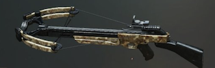
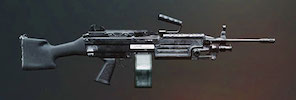
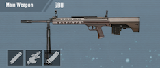

# Pubg Mobile weapons info

---

All pages : [Main page](/index.md) | [Weapons](/weapons.md) | [Controls](/controls/md) | [Tips](/tips.md)

---

## Table of Contents

- [Weapon Categories](#weapon-categories)
  - [Snipers](#snipers)
  - [DMR](#dmr)
  - [Assault Rifles](#assault-rifles)
  - [SMG](#smg)
  - [LMG](#lmg)
  - [Other Weapons](other-weapons)
- [Weapon Details](#weapon-details)
  - [Crate weapons](#crate-weapons)
  - [7.62 weapons](#762-weapons)
  - [5.56 weapons](#556-weapons)
  - [9 mm weapons](#9-mm-weapons)
  - [45 ACP weapons](#45-acp-weapons)

## Weapon Categories

### Weapon stats

Bushka has the best data, I'm not going to copy it here, refer to https://www.thebushka.com/

### Weapon ranges

Various weapons are effective at various range, there are some exceptions, but roughly:

- Shotguns : < 50m
- Pistols, Crossbow, SMGs : < 100M
- AR's : up to ~300M
- DMR's & snipers : >100M, up to 1KM

### Weapon Categories:

Main categories : Snipers, DMR's, AR's, SMG's, the rest (shotguns, pistols, bow, melee)

Note: Weapons are categorized in categories, however these have overlaps, for example the VSS is classified a DMR, while M16A4 is an AR, but in practice you could argue it should be the other way around.

#### Snipers

The whole selling point of a snipers is to one shot kill someone at range, unless you can one shot kill/knock someone they are IMO not that great to use because the opponent will have time to hide while you reload and know where you are.
So for example if they have a level3 helmet and you have a Kar98, it might not even be worth taking that shot.

It's extremely satisfying to snipe someone though.
In duos or squads, it makes sense for someone to carry a sniper. In solo it's more debatable, you may be better served by a DMR or even an AR, especially on smaller maps like Sanhok

I'm leaning more toward DMR's nowadays, because it seems whenever I find a sniper and good scope, I don't find any suitable targets the rest of the game (stationary, at range), so all in all I don't actually get a lot of sniper kills.

#### DMR

A lot if players skip these for a sniper, however I think they are underrated and underused.

If you can not one shot someone at range, because you don't have an AWM, or they have a level 3 helmet, or they are moving too much, any of these scenarios you would be better off with a DMR, where you can spam them repeatedly and finish them off before they hide.

Note, that I think it's very difficult to use these if you are a thumb only player. At the minimum you would want a 3 finger claw, so you can aim with the thumb, while spam firing with another finger.

But if you use claw and are good at spam firing, a DMR like the SKS or Mini14 can be devastating and clear a target before they can even react, it's also by far the best weapon to finish off opponents running around at range.

#### Assault Rifles

They are the king of the current meta, you could easily get a chicken dinner with AR's only, combos like M762 & M416 or AKM & M16A4 can cover almost any engagements others than extreme long range ones, which you can mostly chose to avoid.

There are not a lot of scenarios where you will lose with an AR, potentially in CQC you _might_ lose to a shotgun or Uzi, and at long range you will lose to a good sniper (don't take that fight and don't peek), but pretty much everything else is solid.

#### SMG

It's a bit of a mixed bag, but they can excel at CQC, in general you will want to make sure you have extended mags since the based damage is low and they are meant to spray.

The Uzi and MP5k will beat anything in close quarters (other than a shotgun), as long as your spray is mostly on target.

They tend to have very low recoil and so are easy to keep on target, and while they have a shorter effective range it's actually not as bad as you might think.

#### LMG

The only 2 machine guns are the M249 and DP28 and these can shred both people and vehicles. In squads someone should definitely carry these if available, nothing is better at supressing a whole squad or blowing up a vehicle. In solo it's more debatable if it's worth carrying, but they really are great weapons to have, the only drawback is the reload times are ridiculously high, but keep in mind they have huge mags, so you don't need to reload often.

Really, the only hard part with these is to keep your finger off the reload button, with AR's you get in the habit of reloading in between each engagement (or you may die), with these it's the opposite, if you reload much before you had to, that likely could your death sentence.

#### Other weapons

For the most part the rest of the weapons don't really have a place in the meta and not worth bothering with.

- Shotguns

Ok, shotguns are not that bad and I love me the s12K, they can be devastating in early game hot drops, the problem I have with them is they work awesome 80% of the time, but the 20% when they don't, I die.

It could be my aim, but I think the problem is desync (whereas the player is no longer where you see it on your screen because of network lag). Because you use shotguns in CQC (very close range), desync means that while you see the player right in front of you he might already be to your far left, and so your shotgun shot misses completely. That's why you are better off spraying an SMG or AR.
An exception would be if you know exactly where the user is going to be (door, hallway) then it might work, but anyway overall this makes shotgun not worth carrying in classic games (but very fun in TDM).

Bushka, s12K : https://www.youtube.com/watch?v=xIywSLjKkdc

- Crossbow

I love using the crossbow, and killing someone wth it amazing, yet I never bother picking it up in a classic game, it has no place, unless you want to camp in a bush all game and hope someone passes by, slowly, I guess.

It's completely silent which can be very neat, I really wish they made it a side arm, I would pick it over pistols and it would be fun to use in the right situation.

Bushka, Crossbow: https://www.youtube.com/watch?v=XanKPcyJONQ

- Pistols:

Other than the early game these are not worth bothering with

I have two use for them:

1. In the early game, the high damage or spray ones are the most useful (Deagle, R1895, R45, P18C or Skorpion), the rest are pretty useless, but better than a melee weapon, barely.

2. As a side weapon, in case of emergencies (out of ammo in other 2 guns), for that purpose (panic time) a spray weapon is best, so a P18C or Skorpion is good, but its very rare that I actually have to resort to it.

Bushka, pistols : https://www.youtube.com/watch?v=-ci3NvZqEQQ

- Melee weapons

Pick up the pan to protect from bullets or as a last resort weapon, all the other ones are not worth talking about.

---

### Weapon details

### Crate weapons

I'm separating these because many solo or safe players don't actually get to use them that often.

You have to decide if they worth going after or not, and unless you do it often, you also don't have a chance to get used to them much.

#### MK14

This is a ridiculously OP weapon, but not many people like it. I think there are two reasons:

1. It defaults to a single fire DMR. While it's a very solid DMR, it's a bit hard to use, similar to the SLR, and since most players don't carry it often, they don't get used to it, but once you are used to it, it's like a much stronger Mini14.
2. Some players never use it on auto or try to do it at long range.

The thing is if you put this on auto and use it at reasonable range (because of recoil a bit like an AKM), this thing is crazy damaging, it kills faster than anything else and by a lot, including Uzi, Berryl, Groza, anything, mag is kinda small, need to keep that in mind, but because it does so much damage per bullet it's not actually a big deal.

Bushka MK14 : https://www.youtube.com/watch?v=IWxArl6UxOo

### AUG (AR)

There is really nothing special about the AUG, it's not really any better than other 5.56 ARs such as an M416, Scar, or G36C, only a sightly higher bullet velocity, definitely not worth fighting over a create for.

#### AWM (Sniper)

As I said before, IMO the only point of using a sniper are one shot kills, and the AWM guarantees it (if you land your head shot), so of course you should pick it up. The only drawback it has it's own limited special ammo, so try not to waste it.

Bushka AWM : https://www.youtube.com/watch?v=UrlEfxWhy0M

#### DBS (Shotgun)

the BS stands for what you feel like when that's the only thing left in the crate.
It's an OP weapon, but with no place in the game meta. If you could find it in a early hot drop, that thing would be insanely effective, but the thing is you don't find crates in the early game. By the time you find this, there will be few people left and this thing is useless at any kind of range.

I don't pick it up in solos, in squads, someone might take the risk to pick it up, if it look like the circle is closing on a CQC location like Pochinki or Bootcamp, and even then, as I explained before shotguns are flaky because of dsync ....

Bushka DBS : https://www.youtube.com/watch?v=UHVgXp_807Y

#### Groza (AR)

The Groza is one of the best AR's for sure, very high damage and rate of fire, plus the sound of it just scares people. the only AR I sometimes keep over it is a fully kitted M762, but I think it's only because I'm more used to it (or could be because the M762 can take a grip while the Groza does not), great weapon regardless.

Bushka, Groza : https://www.youtube.com/watch?v=lDnQ3kmHQVg

#### M249 (LMG)

The M249 hold 100, 100! rounds and can shred though squads and vehicles like nothing else. In squads, someone should definitely carry this. It's a little more debatable in solo, but pair it with a jack of all trade like a M416 and sure.

Just don't press the reload button before its down to say 20 bullets AND you have hard cover, I can make a cup of coffee faster than this thing reloads.

Bushka, M249: https://www.youtube.com/watch?v=usoYgImEIxA

### 7.62 weapons

The main things to know about 7.62 weapons are:

1. Highest damage per bullet (~13% more than 5.56)
2. Much higher recoil and tougher spray patterns
3. Lower bullet velocity (More bullet drop at long range)

In other words, they are hard to use, but if you can learn to control them, they are definitely worth it.

These are the weapons you need to practice with and adjust your sensitivity for, but once you get good at them, they can give you the upper hand. Most players carry 5.56 AR's but at close to medium range, if you land your shots, you should absolutely beast them with a 7.62 AR (faster time to kill).

Bushka, 7.62 secrets : https://www.youtube.com/watch?v=wNFCLm4XX50
Bushka, Recoil control :https://www.youtube.com/watch?v=mJa5lW7Ay2Q

#### AKM (AR)

The AKM is pretty hard to handle, but it's very to find and it beat these 5.56 AR's if you land your shots (at close range). I usually cary one unless I find a M762 or Groza.

It can still be effective at longer range, as ong as you keep it on single shot for that, it's not the best weapon for that, but again the high damage per bullet makes it a decent backup option.

It's also a great weapon in the early game, because it has by far the best iron "sights" (flat), no need for any scopes to aim at people.

Bushka AKM vs M416: https://www.youtube.com/watch?v=7YLTCXqOwQw

#### Kar98 (Sniper)

The Kar98 is a solid sniper and relatively easy to find compared to the other ones, though still not common enough to practice with one every game.
I think it's a bit over-hyped because so many streamers use it, but once you get used to it (mostly leading and a bit of drop) it's a fun weapon to use and fairly easy to land head shots with.

Bushka, Kar98 : https://www.youtube.com/watch?v=A947dnDSk9s

#### M762 Beryl (AR)

This is currently my favorite weapon, fully kitted it's absolutely savage.

Its a bit hard to handle, very high recoil, but with a grip it's actually easier than the AKM, but the main thing with this weapon is the time to kill is amazing, best of all AR's (other than Groza by a little), and better than even many SMG.

I think I have the most kills with this weapon.

- Charging a house ? Check, this will win against everything against maybe an Uzi (but the Uzi will need to reload much much sooner). This kills over 30% faster than an M416.
- Blow up a car ? Check (40 bullets of 7.62)
- Suppress fire a squad ? check

The only bad thing about this weapon is the default iron sights are horrible, but stick a red dot on it and it's awesome.

This is also the weapon I do the best with in TDM/arcade modes, even better than the Groza for me.

Bushka, M762 : https://www.youtube.com/watch?v=eRfvMbyKdXs
https://www.youtube.com/watch?v=eRfvMbyKdXs

#### Mk47 Mutant (AR)

I haven't really used this much, IMO the burst weapons don't really have a place in the game, but in general I rather use either an AR or a single shot DMR, this falls in between and is not great at anything much. Early game before people have armor might be the one use case where it's high damage per burst works.

Bushka, M47 : https://www.youtube.com/watch?v=tAIx08Ao5d4

#### M24 (Sniper)

On paper, this is a slightly stronger Kar98, in practice I seem to do better at landing shots with the Kar98, I'm not sure why that is, most likely it's simply because the M24 is so uncommon that I don't get to practice with it enough.

Bushka: Snipers: https://www.youtube.com/watch?v=kevPu71-M3A

### SLR (DMR)

I hate the SLR, I can't control it, I will land one shot (not enough to get a kill) and not land another, the recoil is very bad, so it's kinda slow between shots for a DMR, and I just does not seem accurate or something, anyway it's not for me. Haven't seen many good at it either (including streamers).

If the opponent is stationary, I can land multiple shots (controlled tapping), but if they are moving, I juts can't land the shots.

Bushka, SLR : https://www.youtube.com/watch?v=1O1KYcRQ_bw

#### SKS (DMR)

Still not sure what to make of this one. I use to hate it but I was misusing it probably.Often times that would be the first weapon I would find after finding or 6x or 8x, so I would use it as a "sniper", however just like the SLR, I can't seem to land anything at long range. It has relatively slow bullet speed, so probably lots of drop.

On the other hand at short/medium range you can spam it and destroy people, like a stronger mini14, the thing though, is that's the same range a good low recoil AR can handle (m416 or such), so not sure it has a place in my loadout.

Note: Fully kitted it can be monster in TDM, .... which feels like such a weird use of a "DMR".

Bushka, SKS : https://www.youtube.com/watch?v=RbUyda1KXuc

#### DP28 (LMG)

This is a bit of an oddball, it's very good at blowing up cars and it's very surprisingly stable (manageable recoil) even with a 4x or 6x, which almost seems like a bug for an LMG.

It's basically like a larger mag AR at medium range, which is why many people carry it.

On the other hand, don't use it at short range, the rate of fire is way too slow, and the reloading time will get you killed.

Bushka, DP28 : https://www.youtube.com/watch?v=s69RHKJ2STs

### 5.56 weapons

5.56 AR's are currently the safe bet and what most people default to these.

They combine decent rates of fire, low recoil, high bullet velocity and still decent damage.

While you would think they should lose most engagements against 7.72 AR's, they often don't (especially at longer ranges), simply because how accurate they are, 4 bullets of a M416 on target, is better than 3 of an AK (1 stray bullet)

On the other hand, I think they are greatly overused by people in CQC, 7.62 AR's and SMG's will beat them at that (much lower time to kill)

#### M416 / G36 / QBZ / Scar (AR's)

   

There are a few differences between these weapons in terms of attachments and recoil, but they are pretty much interchangeable IMO.

Almost everyone carry one of these in their loadout, they are basically good at almost everything and very user friendly (low recoil, good bullet speed).

On the other hand, I think a lot of people die trying to use them in CQC or against a sniper at long range, neither these are a good idea. But they do great at anything in between (40M - 400M) and a lot of fights are happening at these ranges.

Bushka 5.56 AR's: https://www.youtube.com/watch?v=1gNINM7vZRw

#### M16A4 (AR)

Just like the mutant, it's a burst weapon, without much of a place in the game.

The burst pattern is pretty erratic, and combined with some recoil, this makes it hard to use in burst and won't beat an AR.

Here are a few things I use it for though,

- Early game, this weapon is everywhere, before people gets good helmets and armor, the burst (even if only 2 land) can do enough damage to kill people
- Poor man Mini14. I put this on single shot, and it can be used as slightly weaker Mini14, with it's high bullet velocity and large mag it can be effective at spamming people running around.

Bushka, M16A4 : https://www.youtube.com/watch?v=COabMDKo508

#### Mini14 (DMR)

This is my Favorite DMR, on paper the damage is weak, but this is extremely easy to use, it has the highest bullet velocity in the game, a large mag, a high rate of fire and very low recoil.

What that really means, is that it shoots exactly where you aim and you can tap it as fast as you can, without worrying in recoil.

Sure, it might take two more shots to finish someone off than a SLR, but I'll actually hit these shots.

I even prefer it to most snipers, say if someone is stationary with a level3 helmet, I have a better chance of finishing them off before they move with a quick 4 bullet spam of Mini14 than having to land 2 Kar98 shots.

What if they are running ? Even better, with a sniper it's a crapshot at best, with the Mini14, I can spam them up to _30_ times before they take cover, only need to land 4 or 5, and it _does_ work.

Bushka, DMR's : https://www.youtube.com/watch?v=zU56O1Os1z8

#### QBU (DMR)

This is on Sanhok only, but this is basically a stronger Mini14, a.k.a awesomeness. The only drawback is it's smaller mag, but with a base damage of 54, you should not need many.

Bushka, tap firing: https://www.youtube.com/watch?v=oHV_yUt0Vn4

### 9 mm weapons

For the most part these are SMG's .... except the VSS which is a .... platypus.

9mm Bullets do very little damage and have low shell velocity, so none of these weapons are any good past short/medium range, but they make up for it with high rates of fire. On the plus side, these weapons have almost on recoil.

Because they are meant to spray and have low damage, a common theme is you **absolutely** want extended mag on these, without them they are barely viable.

#### Bizon (SMG)

When it first came out, I enjoyed it, it's a laser (no recoil) and it's huge mag means you could wipe a (bad) squad without reloading, but the time to kill is actually very poor, so if you try to use it against good players, you wil likely die first.

Bushka, Bizon: https://www.youtube.com/watch?v=kW832AztQ-I

#### Vector (SMG)

A bit odd in that without attachment it's pretty terrible, but fully kitted it's very solid.

Without an extended mag, it's a death wish, you better not waste any of your spray.

Once you ave the extended mag it's not bad, but because it's useless until then, I rarely pick it up

Bushka, Vector: https://www.youtube.com/watch?v=RNIGkQsyQP8

#### Mp5K (SMG)

It's only on Vikendi, but it's a solid weapon, basically a Uzi with a larger mag, longer range and can use scopes (would stick to no more than 3x though).

It feels a little slower to kill than the Uzi to me, but according to Bushka's number I'm wrong on that.

Bushka, MP5K : https://www.youtube.com/watch?v=-MKSctkZN1M

#### Uzi (SMG)

This is probably the best CQC weapon, and one of the only thing I fear it when charging a house with a Beryl, Fastest time to kill.

Its not as useless as the Vector without an extended mag, but still, you definitely want it to buy some safety when your spray is not accurate.

It's weakness is the range, although it's not as bad as you may think either. Because it does not take scopes you at least don't get trapped trying to use it too far, unlike say a s12k or MP5K with a 6x :)

Bushka, best SMGs: https://www.youtube.com/watch?v=cFeCU6t4z3k

#### VSS (DMR, supposedly)

A very oddball weapon.

The good:

- Comes with a good builtin scope
- High rate of fire, the only auto "DMR"
- Low recoil, can easily shoot many bullets in the same spot
- Very low sound

The bad:

- Very low bullet velocity (esp for a "DMR"), means very high bullet drop, and needs to lead by a ton
- Wimpy 9mm rounds, pretty useless without the extended mag

So, if you have the extended mag, and you use it at the sweet spot range, where you can still handle the bullet drop, but the opponent cannot hear you, this can be very fun and effective. You can kill someone quickly without them even knowing what just happened.

But, is this worth carrying over a proper AR/DMR/sniper ? Not really.

Bushka, VSS : https://www.youtube.com/watch?v=N83de71f5bU

### .45 ACP weapons

The best thing about .45 is that the ammo is everywhere and in large quantity, other than that I don't use these much.

#### UMP45 (SMG)

It's not really good at anything, other than it's extremely accurate at short range (no recoil), but it basically as poor range and a long time to kill, so I only use it when it's the only thing I found.

Busha, patch 0.15: https://www.youtube.com/watch?v=WGmwd1VXpos

#### Tommy Gun (SMG)

Few players use this, but it's actually underrated, it kills as fast at the Beryl !
It also has a large mag, unlike say a vector or Uzi, so in the early game and in CQC it's actually very solid.

It's big weakness is that it takes no attachments at all, and the iron sights are pretty bad.

Bushka, best SMGs: https://www.youtube.com/watch?v=cFeCU6t4z3k

#### Winchester 94 (Sniper)

I use to never ever pick that, it was basically a long slow pistol.
Now that it comes with a scope it's a tiny bit more useful, it's also pretty fast between shot, a bit like a cross between a sniper and a DMR

Surprisingly I'm able to land shots with this (medium range), I use it on Miramar, mostly because it's so hard to find any scopes, but the minute I fnd a 3x or better, I drop the winchester and put the scope on anything else instead.

Bushka, win94 : https://www.youtube.com/watch?v=PekelC21PaI
